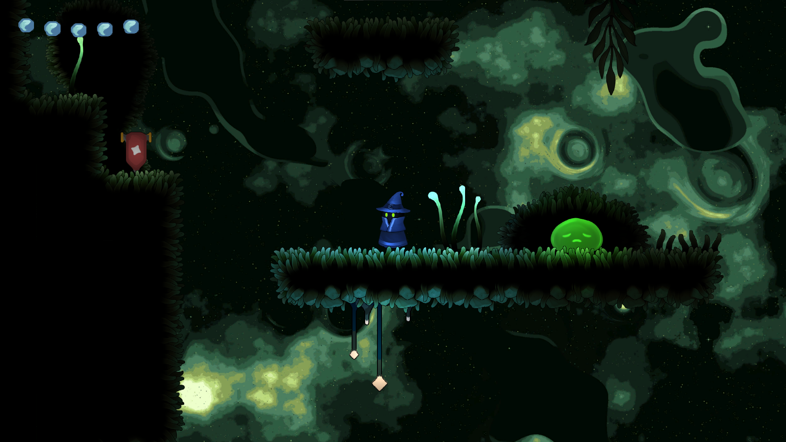
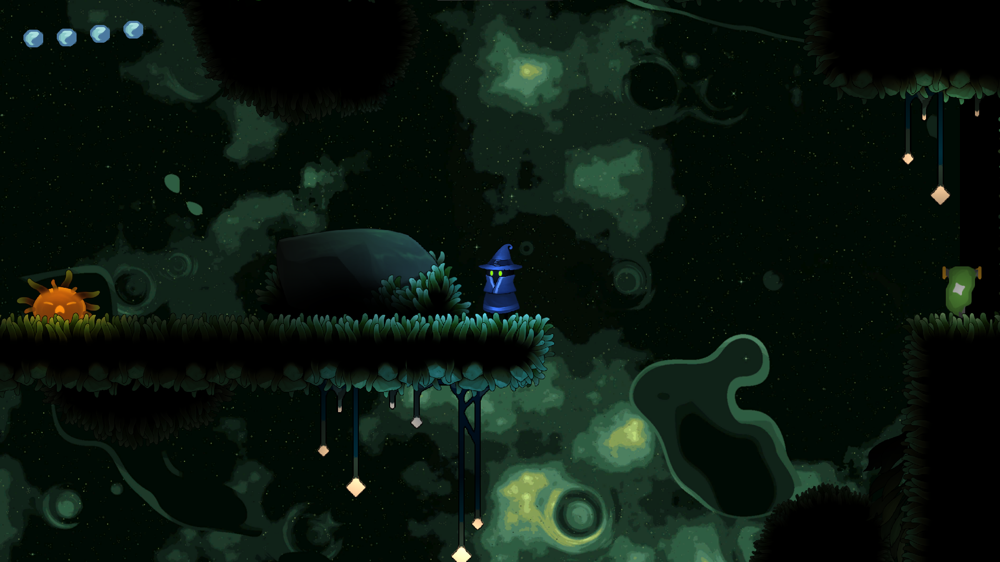
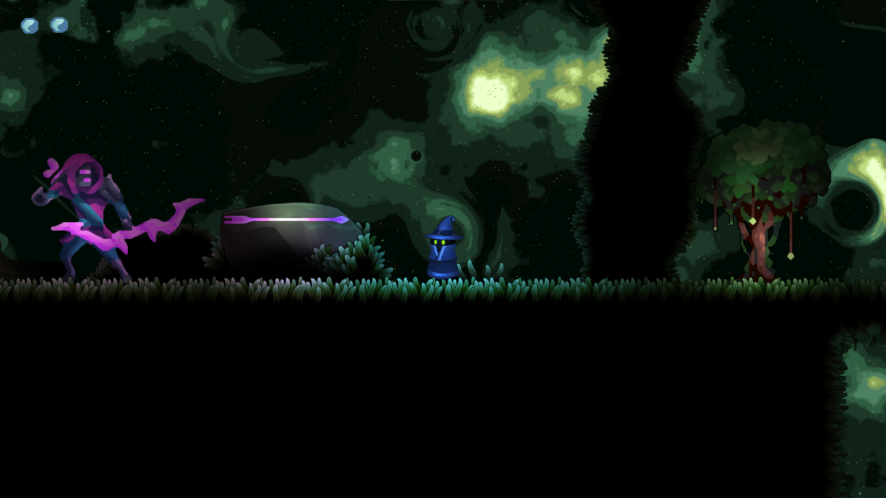

# Unity Platformer 2D

### General Information

This project was made for the ISART Digital school by Rémi Serra.  
The goal was to create a 2D platformer game in C# using Unity Engine.

 

## Preview

 

## Features

- Player
    - Press `A` or `D` to move left or right
    - Press `R` to respawn
    - Press `space` to jump
    - Jump hight depends on how long the key is held
    - Has 5 health points
    - Takes damage and gets knocked back when touched by an enemy
    - Can jump on enemies to damage them  
    
 

- Enemies
    - Green slime
        - Has 1 health point
        - Moves at a constant speed in a direction
        - Changes direction when hitting a wall or before falling
    - Orange slime
        - Has 1 health point
        - Moves towards the player when they are in range
    - Boss
        - Shoots arrows in the player's direction
        - Has 5 health points
        - Gets knocked back when damaged  
        
 

- Environment
    - Spiky vines
    - Bouncy plants
    - Falling platforms
    - Checkpoints
    - Health orbs
